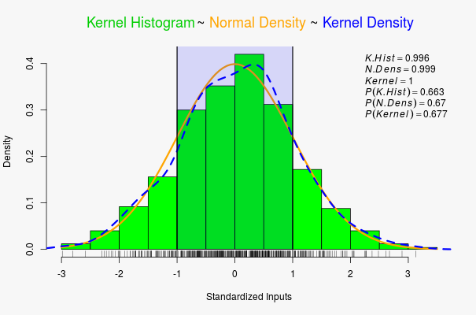
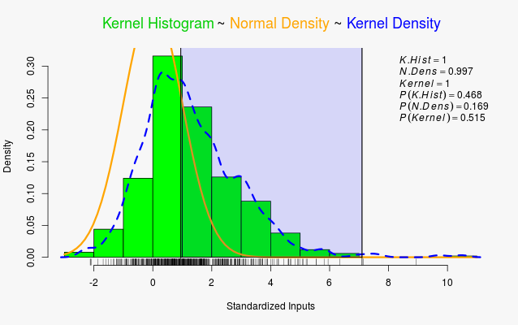

 
## The Shiny App 

1. Explore complex statistical relationships.
2. Find probability of non-normal points.
3. Uncover lost dynamics behind statistics.



--- .class #id 


### Should We Disregard Skew?


<!-- Limit image width and height 
Source: http://stackoverflow.com/questions/16904054/slidify-how-to-position-an-image/18640582#18640582 -->
<style type="text/css">
img {    
  max-height: 560px;    
  max-width: 964px;
}
</style>
 
<!-- Center image on slide -->
<script type="text/javascript" src="http://ajax.aspnetcdn.com/ajax/jQuery/jquery-1.7.min.js"></script>
<script type="text/javascript">
$(function() {    
  $("p:has(img)").addClass('centered');
});
</script>

--- 


### Distributions Share Random Points

- Change features of Kernel / Normal
- Notice, area under curve is not always exactly 1.
- Change `Probability` range, for area of each linked distribution.
- `Tau` skews distribution, and gives different probabilities.



---
 

### From Normal to Skew: Streched by `rexp()`
```{r ,echo = TRUE }
tau <- 3; n <- 1000; x <- sort(rnorm(n)); y <- x +  rexp(x, 1/(tau)) 
```

```{r, echo = FALSE}
xy <- as.data.frame(cbind(x,y))
fit <- lm(y ~ x, xy)
#summary(fit)
par(mfrow = c(1,2))
plot(x,y, main = "Skewed Random--Low R^2")
lines(x,fit$coef[1] + fit$coef[2]*x, col = "red")
qqnorm(y, plot.it = TRUE)
```

---
### 


<!-- Limit image width and height 
Source: http://stackoverflow.com/questions/16904054/slidify-how-to-position-an-image/18640582#18640582 -->
<style type="text/css">
img {    
  max-height: 560px;    
  max-width: 964px;
}
</style>
 
<!-- Center image on slide -->
<script type="text/javascript" src="http://ajax.aspnetcdn.com/ajax/jQuery/jquery-1.7.min.js"></script>
<script type="text/javascript">
$(function() {    
  $("p:has(img)").addClass('centered');
});
</script>


[Dynamic Probabilities (Shiny App)](http://webapptester.shinyapps.io/Dynamic_Probabilities)

GitHub Sources: [Zecca Lehn](https://github.com/ZeccaLehn)


